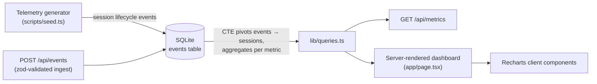

# CallScope

Analytics dashboard for real-time communication (RTC) telemetry — voice calls,
meets and screen shares. Metrics are **derived from a raw event stream with
SQL**, not pre-computed: the store holds immutable session-lifecycle events
(`initiated → ring_started → accepted → connected → reconnect* → ended`), and
every number on the dashboard is an aggregation over them.

Built after working on the call/screenshare/meet stack of a production chat
app, where debugging delivery failures, zombie sessions and reconnect storms
taught me *which* metrics an RTC team actually needs. The data here is
synthetic (generated with realistic distributions), so the project is fully
self-contained — clone, seed, run.

## Quickstart

```bash
npm install
npm run seed   # generates data/callscope.db — ~6,400 sessions / ~26,000 events over 90 days
npm run dev    # http://localhost:3000
npm test       # known-answer tests for the SQL metrics + ingest validation
```

## The metrics, and why they exist

The dashboard is organized around the two questions an owner actually has,
in this order. Vanity metrics are deliberately left out.

### Are people using it?

| Metric | Question it answers |
|---|---|
| **Active users** (+ per-day trend) | How many distinct people used the app, and is that number growing or shrinking vs the previous period? |
| **Time in sessions** (+ per-day trend) | Total connected minutes — the truest engagement line. Session counts can grow while each session gets shorter; minutes don't lie. |
| **Sessions per day by type** | Baseline usage and mix. You can't judge an anomaly without knowing the normal shape (weekday peaks, weekend troughs). |
| **Median session length** | Are conversations substantive or are people bailing early? |

### What's breaking?

| Metric | Question it answers |
|---|---|
| **Connect success rate** | Of everything users tried to start, how much actually connected? The single best health number — a drop here means push delivery, signaling or token problems. |
| **Abnormal end rate** | Of sessions that connected, how many died from something other than a hang-up? This is the release-health canary. |
| **Reconnects per 100 sessions** | Mid-call network churn — rising reconnects predict complaints before drop rates move. |
| **Median ring → accept latency** | How long do callees take to pick up? A rising median often isn't user behavior — it's late ring delivery (dead push tokens, throttled background processes). |
| **Ring outcomes** | `No answer` vs `Missed (unreachable)` are different failures: the first rang and was ignored; the second means *no device ever rang* — the classic silent-delivery bug. Tracking them separately is the point. |
| **Session end reasons** | A hang-up is normal; `network_lost`, `app_killed`, `token_expired`, `server_error` are reliability regressions. |

**Scope honesty:** call telemetry can only explain friction *inside* the app —
failed connects, unreachable devices, drops. Users who churn without ever
starting a call are invisible here; answering "why did they stop opening the
app?" needs product analytics (app-open events, retention cohorts), which is a
different pipeline.

## Architecture



- **Event-sourced storage.** One append-only `events` table
  (`session_id, user_id, event_type, session_type, platform, ts, payload`). A SQL CTE
  pivots events into one row per session; every metric aggregates over that.
  New metrics need a new query, never a schema migration or a backfill.
- **Server components query SQLite directly** (better-sqlite3, read-only
  singleton); chart components are the only client-side JavaScript.
- **The time filter is a URL** (`/?range=7|30|90`) — shareable, back-button
  friendly, zero client state. One filter row scopes every tile and chart, so
  the numbers always agree.
- **`GET /api/metrics?range=30`** exposes the same aggregates as JSON.
- **`POST /api/events`** ingests telemetry — a single event or a batch of up
  to 1,000, validated against a zod schema before touching the store:

  ```bash
  curl -X POST http://localhost:3000/api/events \
    -H "content-type: application/json" \
    -d '{"session_id":"s_demo","user_id":"u_demo","event_type":"initiated","session_type":"call","platform":"android","ts":1751980000000}'
  ```

  Malformed input gets a 400 with per-field issues; on a read-only store
  (the hosted demo) it returns 503 instead of failing silently.

## Testing

`npm test` runs two suites (vitest):

- **Known-answer metric tests** — a hand-built fixture of seven sessions whose
  connect rate, medians, outcome counts and histogram buckets are computable
  on paper, asserted against the real SQL. Also covers time-window filtering.
- **Ingest validation tests** — schema acceptance/rejection cases and payload
  serialization.

## Synthetic data that behaves like real data

`npm run seed` is deterministic (seeded PRNG) and models the shape of real RTC
traffic rather than uniform noise:

- weekday/weekend volume difference, morning + evening diurnal peaks, and a
  slight growth trend across the 90-day window;
- a simulated user base with a long tail of light users, a few heavy ones,
  and sign-ups spread over time — so the active-users trend actually trends;
- lognormal ring→accept latency and per-type session durations (meets run
  long, calls run short);
- meets are *joined*, not rung — they skip the ring lifecycle entirely;
- a realistic failure tail: ring timeouts, unreachable devices, mid-call
  reconnects, and abnormal end reasons at single-digit percentages.

## Design decisions worth noting

- **Colorblind-safe, validated palette** — the three series hues were checked
  programmatically (CVD ΔE separation, lightness band, contrast vs surface)
  in both light and dark mode, not eyeballed. Dark mode uses its own color
  steps, not an automatic flip.
- **Every chart has a table view** (`View as table`) — the WCAG-clean twin of
  the plot, so no value is reachable only by color or hover.
- **Tooltips enhance, never gate**: bar-tip labels and axis ticks carry the
  values; the tooltip repeats them.
- **No dual axes, no pies, thin marks, hairline grid** — chart chrome stays
  recessive so the data is the only loud thing on the page.

## Stack

Next.js (App Router) · TypeScript · SQLite (better-sqlite3) · Tailwind CSS · Recharts

## Deploying

The repo ships a `vercel.json` that seeds the database at build time, and the
Next config bundles it into the serverless functions. The hosted demo is
therefore **read-only** — `POST /api/events` returns 503 there by design;
run locally for the full ingest path.

## What I'd build next

- Platform and session-type dimension filters alongside the date range.
- P95s next to medians (tail latency is where the pain lives), and
  reconnects-per-connected-minute as a network-quality series.
- Anomaly flags: highlight a day when abnormal end reasons exceed a rolling
  baseline.

## License

MIT
